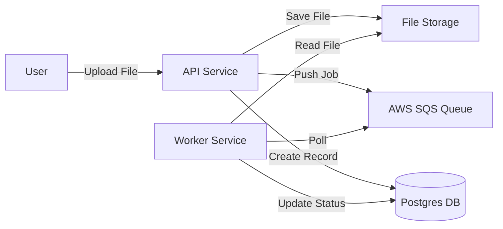

# 🚀 AI Document Processing Pipeline (FastAPI + SQS + Worker)

A production-ready reference architecture for building decoupled document processing systems using **FastAPI**, **AWS SQS** (via LocalStack), and **Docker**.

## 🏗 Architecture

This project follows a **Clean Architecture** pattern with service separation:

-   **🟢 API Service**: FastAPI app that handles file uploads and pushes jobs to SQS.
-   **🔵 Worker Service**: Background worker that polls SQS, processes files (simulated AI extraction), and saves results.
-   **🟣 Shared Library**: Common database models, schemas, and configurations used by both services.
-   **🗄 Infrastructure**: Postgres (Database) and LocalStack (SQS emulation) running in Docker.



## 📂 Project Structure

```
ai-document-pipeline/
├── api_service/          # FastAPI Application
├── worker_service/       # Background Processing Worker
├── shared/               # Shared Models & Utils
├── tests/                # End-to-End Tests
├── docker-compose.yml    # Orchestration
└── requirements.txt      # Dependencies
```

## 🚀 Getting Started

### Prerequisites
-   Docker & Docker Compose
-   Python 3.11+ (for local testing)

### Running the System

1.  **Start Services**:
    ```bash
    docker-compose up --build
    ```

2.  **Initialize SQS** (Only if not auto-initialized):
    ```bash
    docker-compose exec localstack /etc/localstack/init/ready.d/init_sqs.sh
    ```

3.  **Access API Docs**:
    -   Swagger UI: [http://localhost:8000/docs](http://localhost:8000/docs)

### 🧪 Verification

Run the end-to-end test script to simulate a user upload and check processing status:

```bash
python tests/e2e_flow.py
```

## 🔌 API Endpoints

### `POST /api/v1/documents/`
Upload a document.
-   **Input**: Multipart Form (`file`)
-   **Output**: JSON `{ "id": "uuid", "status": "PENDING" }`

### `GET /api/v1/documents/{job_id}`
Check the status of a job.
-   **Output**: JSON `{ "id": "uuid", "status": "COMPLETED", "result": {...} }`

## 🛠 Tech Stack

-   **Framework**: FastAPI
-   **Queue**: AWS SQS (LocalStack)
-   **Database**: PostgreSQL (SQLAlchemy + Pydantic)
-   **Containerization**: Docker
-   **Language**: Python 3.11
